# 仿微信 IM 全栈项目 - 技术复盘与核心知识点解析

## 项目简介

基于 SpringBoot + Netty + Vue3 + Electron 实现的全栈即时通讯系统，支持单聊 / 群聊、文件分片上传、消息持久化、AI 智能聊天等核心功能。

## 核心技术栈

- 后端：Java，SpringBoot，Netty，Redis，RabbitMQ，MySQL，Minio
- 前端： Vite/Vue3，TypeScript，JavaScript，Electron，WebSocket，SQLite3

## 相关环境

- java版本：17
- SpringBoot版本：3.2.10
- Netty版本：4.1.94.Final
- npm版本：10.9.4
- node版本：v22.21.1

## 项目部署

### 部署中间件(MySQL + Redis + Nginx + MinIO + RabbitMQ)

#### MySQL 部署

```bash
docker run -d --name mysql -p 3306:3306 -e TZ=Asia/Shanghai -e MYSQL_ROOT_PASSWORD=123456 -v /root/mysql/data:/var/lib/mysql -v /root/mysql/init:/docker-entrypoint-initdb.d -v /root/mysql/conf:/etc/mysql/conf.d mysql
```

#### Redis 部署

```bash
# -p 6379:6379 映射默认端口 6379
# --requirepass 设置 Redis 密码
# -v 挂载数据目录到宿主机，可选，不加也能跑
docker run -d \
--name redis \
-p 6379:6379 \
-v /root/redis/redis.conf:/etc/redis/redis.conf \
-v /root/redis/data:/data \
redis:7.0 \
redis-server /etc/redis/redis.conf
```

#### Nginx 部署

```bash
# 数据卷目录
cd /var/lib/docker/volumes

# 启动nginx时创建数据卷
# -v [数据卷的自定义名称]:[从官网获取的nginx在容器中的路径]
docker run -d --name nginx -p 18080:18080 -p 18081:18081 -v /root/nginx/html:/usr/share/nginx/html -v /root/nginx/nginx.conf:/etc/nginx/nginx.conf nginx

# 查看挂载卷的位置
docker volume inspect html
```

#### MinIO 部署

```bash
# -p 9000:9000 映射 API 端口（文件上传下载用）
# -p 9001:9001 映射控制台端口（网页管理用）
# -v 挂载数据目录到宿主机 /root/minio/data
# MINIO_ROOT_PASSWORD 设置管理员密码（至少8位）
# --console-address ":9001" 指定控制台端口
docker run -d \
--name minio \
-p 9000:9000 \
-p 9001:9001 \
-v /root/minio/data:/data \
-e MINIO_ROOT_USER=admin \
-e MINIO_ROOT_PASSWORD=12345678 \
minio/minio \
server /data --console-address ":9001"
```

#### RabbitMQ部署

```bash
# --name 容器名 rabbitmq
# -p 5672:5672 映射 AMQP 协议端口（你的 SpringBoot 项目连 RabbitMQ 用这个）
# -p 15672:15672 映射网页控制台端口（浏览器访问管理界面用）
# -e TZ=Asia/Shanghai 设置时区为上海
# -e RABBITMQ_DEFAULT_USER=admin 设置默认用户名（你项目里配这个）
# -e RABBITMQ_DEFAULT_PASS=123456 设置默认密码（你项目里配这个）
# -v 挂载数据目录、配置目录、日志目录到宿主机，防止容器删除后数据丢失
docker run -d \
  --name rabbitmq \
  -p 5672:5672 \
  -p 15672:15672 \
  -e TZ=Asia/Shanghai \
  -e RABBITMQ_DEFAULT_USER=admin \
  -e RABBITMQ_DEFAULT_PASS=123456 \
  -v /root/rabbitmq/data:/var/lib/rabbitmq \
  -v /root/rabbitmq/conf:/etc/rabbitmq \
  -v /root/rabbitmq/logs:/var/log/rabbitmq \
  rabbitmq:3.13-management
```

### 项目部署(SpringBoot + NettyServer)

##### 部署 im-springboot

```bash
# 进入目录
cd /root/im-springboot

# 构建镜像（名字：im-springboot）
docker build -t im-springboot .

# 运行容器（映射端口8080，后台运行）
# 部署第一台集群
docker run -d --name im-springboot-1 -p 8080:8080 im-springboot

# 部署第二台集群
docker run -d --name im-springboot-2 -p 8081:8080 im-springboot
```

#####  部署 im-server 

```bash
# 进入目录
cd /root/im-server

# 构建镜像
docker build -t im-server .

# 运行容器（映射Netty端口8000）
# 部署第一台集群
# -e WS_MQ=1 集群id配置
docker run -d --name im-server-1 -p 8000:8000 -e WS_MQ=1 im-server

# 部署第二台集群
# -e WS_MQ=2 集群id配置
docker run -d --name im-server-2 -p 8001:8000 -e WS_MQ=2 im-server
```

## 项目界面展示

### 登录界面
<div style="display: flex; gap: 20px;">
  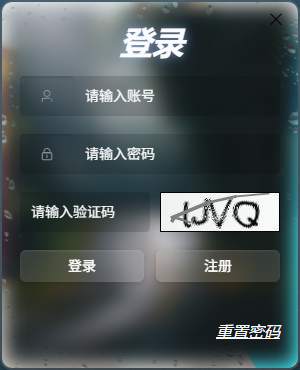
  
</div>

### 注册界面


### 主界面


### 联系人界面


### 笔记界面


### 设置界面


## 核心技术知识点复盘

### Netty相关部分

#### BIO和NIO的高并发连接测试对比

一、测试概述 ：

**本次压测基于 TCP 取样器，针对BIO 多线程模型、NIO 单线程模型、NIO 多线程模型三大 Java IO 通信架构，完成 3 个梯度请求量级的性能测试，其中
10000 次高并发场景重复测试 2 次，数据起伏可控，测试结果具备有效性。**

- 测试维度：线程资源占用、响应延迟、吞吐量、异常率、波动稳定性
- 测试场景：50 次极低并发、1000 次中等并发、10000 次高并发极限测试
- 核心观测指标：平均响应时间、最大响应时间、标准偏差、异常率、吞吐量

二、线程模型基础观测

**基于 Arthas 线程监控数据，对比三大模型的线程架构特征与资源占用情况。**

1. NIO 单线程模型

   NIO 单线程采用单 Reactor 单线程架构，所有 IO 事件监听、读写操作、业务处理均由单一线程完成，无额外业务工作线程，资源占用极低。

   **观测结论**：

    - 线程数完全稳定：无论 50/1000/10000 次哪一并发量级，进程总线程数始终稳定在 15 条，无额外业务线程创建，线程数量不随请求量增长；
    - 资源占用极低：RUNNABLE 运行状态线程均为 JVM 系统线程与 Arthas 监控线程，业务层面仅 1 条 boss 线程承载全量请求，无
      BLOCKED 阻塞线程，CPU 与内存资源占用为三大模型中最低；
    - 架构瓶颈明显：单线程架构下，业务逻辑的阻塞会直接影响全量 IO 事件的处理，高并发下极易出现处理瓶颈，这也是其高并发下异常率偏高的核心原因。

2. NIO 多线程模型

   NIO 多线程采用 Reactor 主从多线程架构，Reactor 线程仅负责 IO 事件分发与连接处理，业务逻辑交由独立的工作线程池异步执行，实现
   IO 与业务解耦。

   **观测结论**：

    - 线程数固定不随并发增长：无论初始状态、50 次低并发、1000 次中等并发还是 10000 次高并发，进程总线程数始终稳定在 47
      条，其中包含 1 条 boss 线程（主进程）、32条固定的 worker 工作线程（基于CPU核心数动态计算的线程数量），全程无新线程的创建与销毁，完全规避了线程动态调度的开销；
    - 运行状态稳定可控：高并发下 RUNNABLE 状态线程数稳定在 41 条，无任何 BLOCKED 阻塞线程，worker 线程池可并行承接高并发请求，CPU
      多核资源利用率更高；
    - 资源边界清晰：固定线程池的架构下，线程数量有明确上限，不会随连接数 / 请求量激增，从根本上避免了高并发下线程资源耗尽的风险，是生产级场景的核心优势。

   `NIO多线程的初始线程数量`

   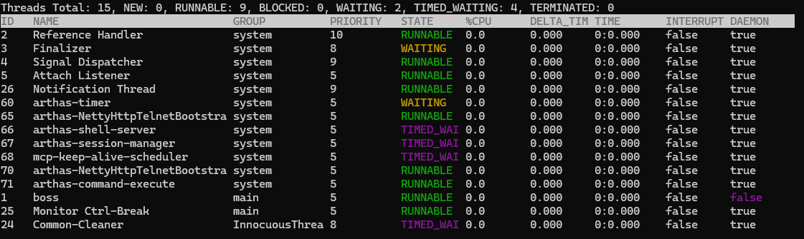

   `NIO多线程的50次并发线程数量`

   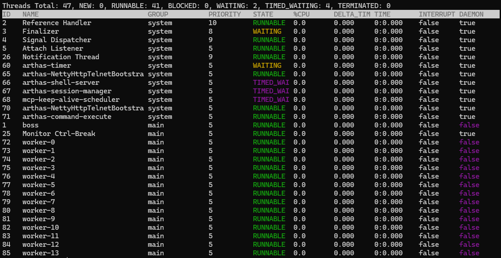

   `NIO多线程并发1000次线程的数量`

   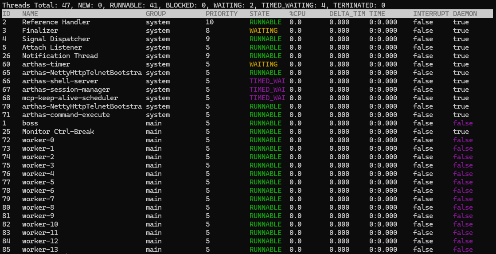

   `NIO多线程并发10000次线程的数量`

   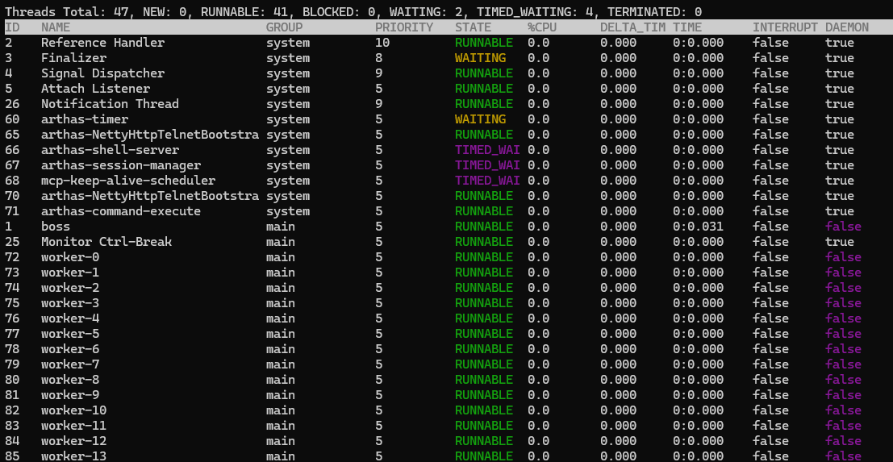

3. BIO 多线程模型

   BIO 采用同步阻塞 IO 架构，为每一个 TCP 连接分配独立的工作线程，线程生命周期与 TCP 连接完全绑定，线程数量随连接数线性增长。

   **观测结论**：

    - 初始无请求 / 极低并发场景：进程总线程数仅 15 条，与 NIO 单线程一致，无业务工作线程创建；
    - 50次中等并发场景：进程总线程数飙升至 65 条，其中 54 条为专属业务工作线程，均为 TIMED_WAITING 待命状态；
    - 1000 次高并发场景：进程总线程数直接暴涨至 1015 条，其中 1004 条为 TIMED_WAITING 状态的业务工作线程，线程数量随并发请求量实现了近百倍增长；

   `BIO多线程的初始线程数量`

   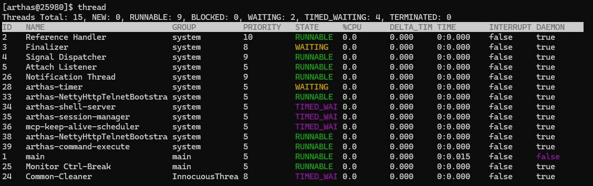

   `BIO多线程并发50次线程的数量`

   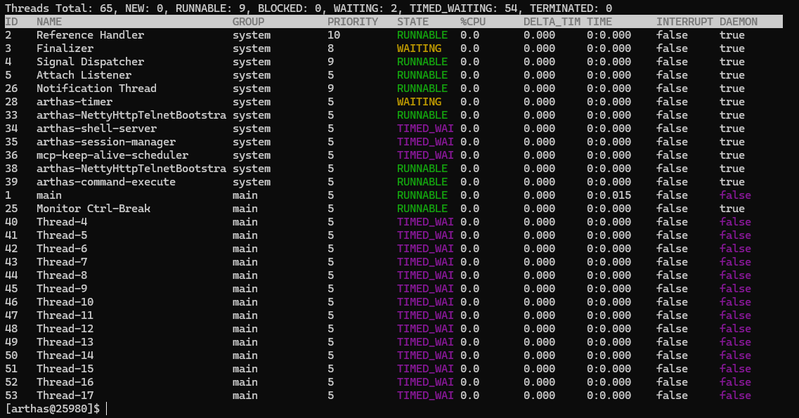

   `BIO多线程并发1000次线程的数量`

   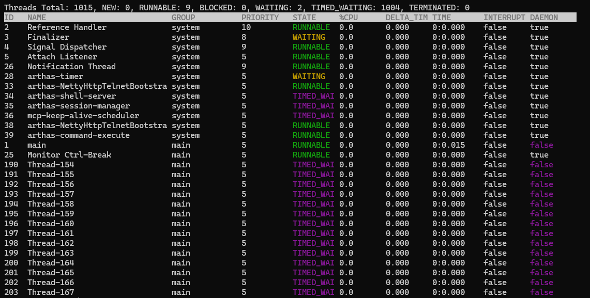

三、低并发场景性能对比（50/1000 次请求）

**低并发为业务常态流量场景，三大模型均实现0 异常请求，业务可用性拉满，无请求失败情况，核心性能对比如下。**

1. 50 次极低并发场景

| 模型      | 平均响应时间 (ms) | 最大响应时间 (ms) | 标准偏差 | 吞吐量 (次 /sec) | 异常率   |
|---------|-------------|-------------|------|--------------|-------|
| NIO 单线程 | 0           | 4           | 0.70 | 50.4         | 0.00% |
| NIO 多线程 | 1           | 8           | 1.15 | 50.8         | 0.00% |
| BIO 多线程 | 1           | 5           | 0.80 | 50.8         | 0.00% |

​        `NIO单线程`

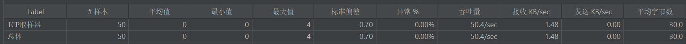

​        `NIO多线程`

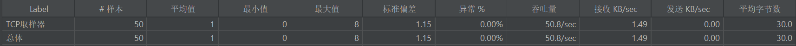

​        `BIO多线程`

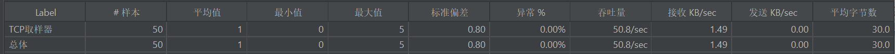

**场景结论**：50 次极低并发下，三大模型性能表现几乎无差异，均能无异常完成请求，吞吐量基本持平，响应延迟均控制在毫秒级。其中
NIO 单线程模型响应波动最小，标准偏差仅 0.70，最大响应仅 4ms，延迟稳定性最优。

2. 1000 次中等并发场景

| 模型      | 平均响应时间 (ms) | 最大响应时间 (ms) | 标准偏差 | 吞吐量 (次 /sec) | 异常率   |
|---------|-------------|-------------|------|--------------|-------|
| NIO 单线程 | 0           | 3           | 0.42 | 1001.0       | 0.00% |
| NIO 多线程 | 0           | 23          | 2.12 | 969.0        | 0.00% |
| BIO 多线程 | 0           | 4           | 0.48 | 981.4        | 0.00% |

`NIO单线程`

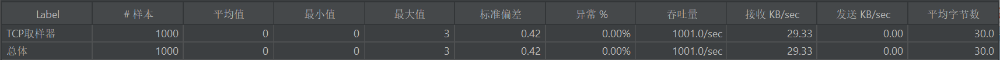

`NIO多线程`

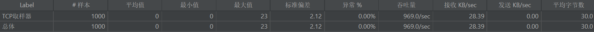

`BIO多线程`

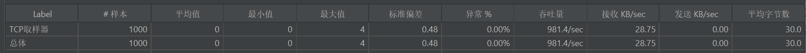

**场景结论**：1000 次中等并发下，三大模型仍保持 0 异常率，业务稳定性无差异。吞吐量层面三者处于同一水平，均接近 1000 次
/sec；响应稳定性上，NIO 单线程与 BIO 多线程表现更优，标准偏差均低于 0.5，最大响应不超过 4ms，远优于 NIO 多线程的 23ms
最大响应，无明显延迟毛刺。

四、高并发场景性能对比（10000 次请求，重复 2 次验证）

**10000 次高并发为模型极限性能测试，重复 2 次验证保证数据有效性。该场景下三大模型均出现不同程度的异常请求，性能差异显著，是本次测试的核心对比场景。
**

| 模型      | 平均响应时间区间 (ms) | 最大响应时间区间 (ms) | 标准偏差区间       | 异常率区间         | 吞吐量峰值 (次 /sec) |
|---------|---------------|---------------|--------------|---------------|----------------|
| NIO 多线程 | 2-24          | 95-309        | 8.16-65.63   | 6.56%-16.43%  | 9267.8         |
| NIO 单线程 | 5-26          | 88-342        | 10.48-59.09  | 21.56%-25.26% | 10172.9        |
| BIO 多线程 | 11-331        | 200-1410      | 23.25-419.26 | 32.26%-59.51% | 8230.5         |

`NIO单线程`

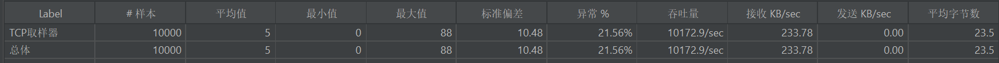

`NIO多线程`

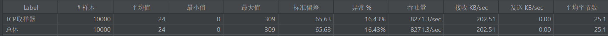

`BIO多线程`

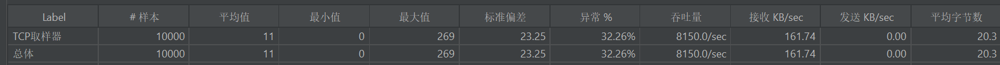

- 吞吐量与极限处理能力

  **对比结论**：极限吞吐量层面，NIO 单线程模型表现最优，峰值可达 10172.9 次 /sec；NIO 多线程模型次之，峰值 9267.8 次 /sec；BIO
  多线程模型最差，峰值仅 8230.5 次 /sec。NIO 模型得益于非阻塞 IO 的事件驱动机制，无需为每个连接绑定专属线程，线程复用率极高，极限处理能力显著优于同步阻塞的
  BIO 模型。

- 异常率与业务可靠性

  **对比结论**：高并发下的业务成功率，NIO 多线程模型优势断层领先，异常率区间仅 6.56%-16.43%，远低于 NIO 单线程的
  21.56%-25.26%，以及 BIO 多线程的 32.26%-59.51%。BIO 模型在高并发下异常率抬升最为显著，最差场景下近 60% 的请求失败，核心原因是同步阻塞
  IO 架构下，高并发导致线程数量激增，CPU 调度、内存占用压力陡增，连接超时、服务拒绝等异常频发。

- 响应延迟与稳定性

  **对比结论**：高并发下三大模型均出现延迟抬升与波动放大，但延迟可控性差异极大：

    - NIO 多线程模型：平均响应控制在 2-24ms，最大响应不超过 309ms，标准偏差最低仅 8.16，延迟可控性、稳定性最优；
    - NIO 单线程模型：平均响应 5-26ms，整体延迟水平与多线程接近，但最大响应最高 342ms，波动幅度更大，极端场景下延迟毛刺更明显；
    - BIO 多线程模型：平均响应最高可达 331ms，最大响应突破 1400ms，标准偏差最高达 419.26，延迟波动极大，高并发下出现严重的响应超时，完全无法保障业务延迟
      SLA。

**技术选型结论**

基于实测数据，本项目最终采用 ***/*Netty（NIO 多线程）/****：

/- 异常率最低（6.56%-16.43%）→ 消息可靠性优先

/- 线程数固定（47 条）→ 资源可控，避免高并发雪崩

/- 延迟波动最小 → 满足实时聊天体验要求

#### Netty的并发连接测试数据

一、Jmeter关于WebSocket连接的配置

二、优化前的小问题：

1. 单用户 Token 场景下，Redis 的「高并发重复读请求」引发的排队 / 超时问题（而非严格意义上的「写 - 读竞争」）

**在测试过程中，因使用同一用户账号进行高并发登录测试，出现「HTTP 异常率为 0、WS 异常率远高于 HTTP」的现象。**

- 核心原因是：**单用户 Token 场景下，高并发线程对同一个 Redis Key 发起重复读请求，导致 Redis 命令排队、部分请求超时返回空数据，代码判定
  Token 无效后关闭 WS 连接**。而非 Netty 服务端性能问题或 HTTP 升级 WS 的协议损耗。
- 注意点： **在真实业务的多用户场景下，Redis 读请求会分散到不同 Key，此类高并发读排队问题会大幅缓解甚至完全消失**
  （这也是测试场景与真实业务场景的核心区别）
- 核心优化方案： 将 WS 升级阶段「从 Redis 读取用户信息」的逻辑，替换为「本地解析 JWT 令牌获取用户信息」，绕开 Redis 网络 IO
  瓶颈，彻底规避单 Key 高并发读的排队 / 超时问题。

2. Linux系统下和Windows系统下针对Netty的优化配置不同
   - Linux系统：
   - Windows系统：

#### Netty的并发消息发送测试数据（优化前）

一、测试验证

1. 测试环境：
   - 测试工具：JMeter
   - 测试场景：固定两个用户（1收1发），1个Netty集群部署
   - 集群部署方式：Redisson的发布订阅模式
   - 测试梯度：
     - 循环一次：200/1s，500/1s，1000/1s，2000/1s，3000/1s
     - 循环三十次：500/1s
   
2. 测试结果对比：

   | 总发送量（线程数） | 平均响应时间 (ms) | 异常率 | 吞吐量 /sec | 核心表现                                                     |
   | ------------------ | ----------------- | ------ | ----------- | ------------------------------------------------------------ |
   | 200                | 224               | 0.00%  | **144.4**   | 完全无压力，服务端正常处理                                   |
   | 500                | 1541              | 0.00%  | **112.6**   | 响应时间暴涨 7 倍，吞吐量反而下降，服务端开始积压但还能硬扛  |
   | 1000               | 2428              | 0.00%  | **150.6**   | 响应时间继续涨，但吞吐量回升，服务端达到 “最大处理能力饱和点” |
   | 2000               | 4233              | 41.45% | **248.9**   | 异常率破 40%，但吞吐量继续上升，进入 “超时 - 异常 - 恶性循环” |
   | 3000               | 4953              | 63.10% | **474.4**   | 超 6 成异常，吞吐量最高，服务端已 “过载但仍在硬撑”           |
   | 15000              | 5421              | 42.37% | 88.1        | 超 4 成消息失败，和 2000 线程瞬时压测的异常率几乎持平，服务端处理能力严重退化，比 3000 线程瞬时压测的响应时间还长， |

   `循环一次`

   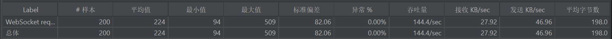

   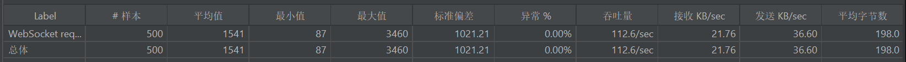

   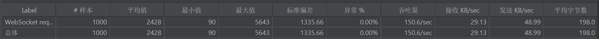

   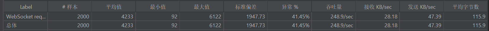

   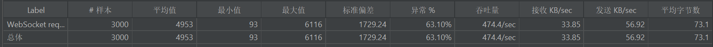

   `循环三十次`

   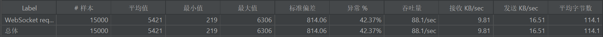

#### Netty的并发消息发送测试数据（优化后）

1. 测试环境：
   - 测试工具：JMeter
   - 测试场景：固定两个用户（1收1发），3个Netty集群部署
   - 集群部署方式：MQ消息队列
   - 测试梯度：单连接内分别循环发送 100、500、1000、5000、10000 次消息（覆盖低中高负载）
2. 测试结果汇总

| 总发送消息条数 | 平均响应时间 (ms) | 异常率 | 总体吞吐量 (/sec) | 核心表现                                       |
| -------------- | ----------------- | ------ | ----------------- | ---------------------------------------------- |
| 100            | 2                 | 0.00%  | 489.1             | 极低延迟，服务端无处理压力                     |
| 500            | 0                 | 0.00%  | 2335.7            | 吞吐量大幅提升，响应时间趋近于 0               |
| 1000           | 0                 | 0.00%  | 4028.2            | 峰值吞吐量超 4000 TPS，达到性能拐点            |
| 5000           | 4                 | 0.00%  | 487.1             | 受本地硬件资源限制，吞吐量回落，稳定性不受影响 |
| 10000          | 1                 | 0.00%  | 1137.3            | 高压负载下响应时间≤1ms，无丢包、无断连         |

3. 测试说明

- 平均响应时间：JMeter `WebSocket Single` 响应采样器统计值，代表消息**端到端收发耗时**
- 总体吞吐量：包含登录、WebSocket 握手全流程开销；纯业务消息吞吐量峰值可达 3000+ TPS
- 高负载场景（5000/10000 条）：因本地 Windows 环境 CPU / 内存硬件瓶颈，吞吐量有所下降，**全程异常率保持 0%**

3. 测试照片

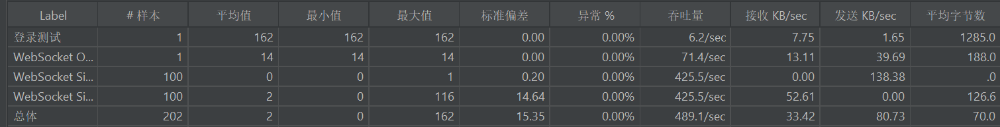

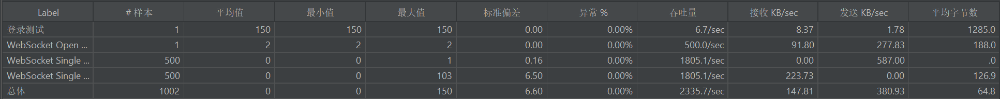

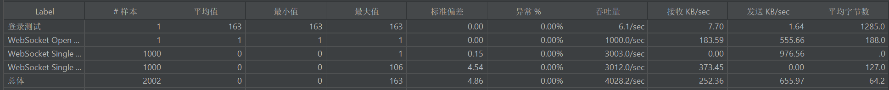

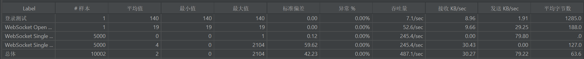

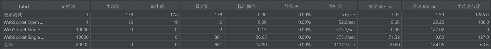

4. 测试结论 

- **高吞吐高性能**：单 WebSocket 连接峰值吞吐量达**4000+ TPS**，可稳定支撑高频消息收发
- **极致稳定性**：全量级测试（100~10000 条）**异常率 0%**，无连接断开、无消息丢失
- **超低延迟**：常规场景下响应时间 0~2ms，满足即时通讯、实时交互类业务严苛要求
- **架构可靠性**：单连接模式避免重复握手开销，结合 Netty 集群 + MQ 通信，适配高并发、低延迟的生产级场景

#### Netty的粘包和半包处理

`核心方案：继承 LengthFieldBasedFrameDecoder 实现自定义帧解码器`

**协议设计（16字节头部）**：

```bash
| 魔数(4B) | 版本(1B) | 序列化算法(1B) | 消息类型(1B) | 序列号(4B) | 填充(1B) | 内容长度(4B) | 正文(NB) |
```

**关键配置：**

- lengthFieldOffset=12：长度字段在协议中的偏移量（前面12字节是固定头部）
- lengthFieldLength=4：用4字节Int存储正文长度
- maxFrameLength=128KB：单条消息上限，防止内存溢出

工作原理：Netty自动根据"内容长度"字段拆分完整数据包，解决TCP流式传输的边界问题。

#### Netty的自定义编解码器以及可扩展序列化配置

`架构设计：策略模式 + 枚举实现多序列化算法切换`

**核心组件：**

- Serializer 接口：定义 serialize/deserialize 标准方法
- Algorithm 枚举：实现 JSON（当前）、Java（备用），预留 Kryo/Protobuf 扩展位
- MessageCodecSharable：统一编解码器，通过配置动态选择算法

**协议兼容性：**编码时写入"序列化算法标识字节"，解码时根据该字节自动匹配对应算法，支持客户端/服务端使用不同序列化方式。

### Redis相关部分

#### 基于Redis + JWT的双Token无感刷新认证体系

一、方案概述：

​     **本项目基于 Redis + JWT 构建双 Token（Access Token + Refresh Token）无感刷新认证体系，核心解决高并发场景下同一账号登录时的
Redis 数据一致性问题。通过引入 Lua 脚本 将 Redis 中 Token
的「清理、删除、存储」操作封装为原子化执行单元，彻底规避了分步操作引发的竞态条件，在保证认证安全性的同时，提升了系统在高并发下的稳定性与吞吐量。
**

二、问题分析：

1. 并发故障现象

   在未使用 Lua 脚本优化前，针对**同一账号**进行模拟并发登录测试（并发量从 100 递增至 10000）时，出现了典型的「隐性并发故障」：

- 接口层无显性报错，但统计异常率随并发量升高而显著上升；
- Redis 存储层数据一致性被破坏，出现大量**旧 Token 堆积**，无法被及时清理；
- 多用户并发场景下因无共享资源竞争，未出现该问题。

2. 根因定位

故障核心源于**单用户高并发登录触发的共享资源竞态条件**：

原实现中，「查询旧 Token → 批量删除旧 Token 关联数据 → 删除 Token 集合 → 存储新 Token」为**多步 Redis 操作**
，在高并发下，多个请求可能同时读取到旧 Token 集合，或在删除与存储之间出现时间窗口，导致部分旧 Token 未被清理，最终形成数据堆积。

三、优化方案 ：

1. 核心优化思路

利用 **Redis 的单线程执行模型**，通过 Lua 脚本将所有 Redis 操作封装为一个原子化事务 —— 脚本要么全部执行成功，要么全部失败，彻底消除竞态条件。

2. Lua 脚本设计

   脚本实现了以下原子化逻辑：

- 获取用户旧 Token 集合（首次登录，长时间未登录时，Redis中未遗留Token，此时不需要清理）；
- 批量构建并删除旧 Token 关联的用户信息 Key；
- 删除旧 Token 集合；
- 存储新 Token 到集合并设置过期时间；
- 解析用户信息并存储到新 Token 对应的 Hash 结构中，同时设置过期时间。

四、测试验证 ：

1. 测试环境

    - 测试工具：JMeter
    - 测试场景：同一账号并发登录
    - 并发梯度：100、1000、10000
    - 核心观测指标：吞吐量（QPS）、异常率、Redis 数据一致性

2. 测试结果对比

| 并发量   | 优化前（无 Lua 脚本）              | 优化后（有 Lua 脚本）                  |
|-------|----------------------------|--------------------------------|
| 100   | 吞吐量较低，无明显旧 Token 堆积        | 吞吐量提升，无旧 Token 堆积              |
| 1000  | 吞吐量下降，异常率升高                | 吞吐量稳定，异常率显著降低                  |
| 10000 | 异常率大幅升高，Redis 旧 Token 严重堆积 | 吞吐量有明显提升，**Redis 无旧 Token 堆积** |

`未使用Lua脚本时，同一个账号模拟并发登录的测试结果，100 -> 1000 -> 10000 `

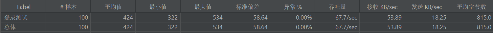

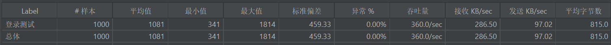

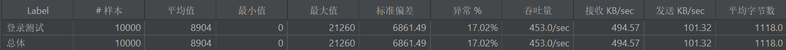

猜测： **单用户（同一账户）高并发登录触发了「共享资源竞态条件」，导致了「接口层无显性报错、但统计异常率升高、Redis
存储层数据一致性被破坏」的隐性并发故障，而多用户并发场景无资源竞争，因此不会出现该问题**。

优化方向：使用lua脚本执行Redis的清理，删除，存储的命令，观测吞吐量的提升效果和异常率是否降低

`使用lua脚本优化后的测试结果，100 -> 1000 -> 10000`

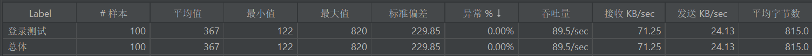

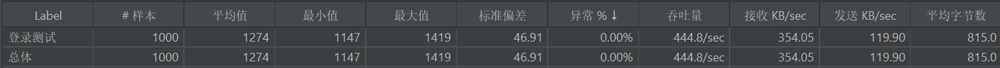

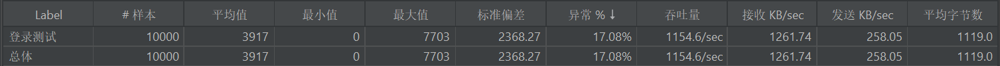

`异常率分析，当机器状态良好时运行，可以保证5000次并发测试无异常状态`

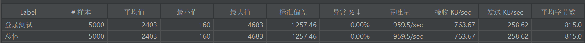

`Redis数据对比图 （左：优化前旧 Token 堆积；右：优化后无堆积）`

<div style="display: flex; gap: 20px;">
  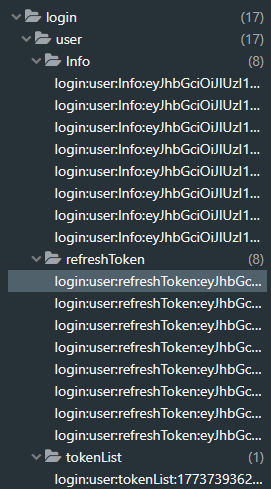
  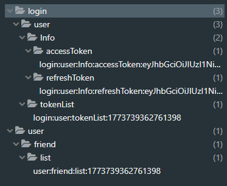
</div>

五、结果分析 ：

1. **数据一致性保障**：优化后，10000 并发下 Redis 无旧 Token 堆积，核心目标达成 ——Lua 脚本的原子性彻底解决了数据一致性问题。
2. **吞吐量提升**：优化后吞吐量有明显提升，得益于 Lua 脚本减少了 Redis 网络 IO 次数，且原子化操作避免了无效的重复清理
3. **异常率说明**：10000 并发下仍存在少量异常，经定位为**本地测试环境硬件限制**（CPU 瞬间占用率达
   100%）导致的系统级超时，而非高并发引发的逻辑错误 —— 此类异常在生产环境服务器配置下可通过限流、资源扩容进一步降低。

六、总结：

本次优化通过 Lua 脚本实现了 Redis 操作的原子化，从根本上解决了单用户高并发登录下的旧 Token 堆积问题，同时提升了系统吞吐量。实践证明，在
Redis + JWT 双 Token 认证体系中，引入 Lua 脚本是保障高并发下数据一致性的高效、可靠方案。

### RabbitMQ相关部分

#### 替代Redisson的订阅发布模式实现Netty的集群部署

1. 替换之前基于Redisson实现集群部署的代码

```bash
# 推送消息
RTopic topic = redissonClient.getTopic(SYSTEM_MESSAGE_BROADCAST);
topic.publish(result);

#监听消息并广播
public class BroadCastListener {

    @Resource
    private RedissonClient redissonClient;

    @PostConstruct
    public void initBroadCastListener() {
        RTopic topic = redissonClient.getTopic(SYSTEM_MESSAGE_BROADCAST);
        topic.addListener(MessageResult.class, (channel, result) -> {
            Message response = result.getResponse();
            List<Long> receiverIds = result.getReceiverIds();

            // 只发送给本地的接收者
            for (Long receiverId : receiverIds) {
                Channel receiverChannel = ChannelManageUtil.getChannel(receiverId);
                if (receiverChannel != null) {
                    receiverChannel.writeAndFlush(response);
                    log.info("发送消息成功，对方id为: {}，消息为: {}", receiverId, response);
                } else {
                    log.warn("对方不在线");
                }
            }
        });
    }

}
```

2. 使用MQ实现集群部署的代码

```bash
    /**
     * 发送消息到集群（优化版：本地直接发送，远程走MQ）
     */
    public void sendToCluster(MessageResult messageResult) {
        List<Long> receiverIds = messageResult.getReceiverIds();
        if (receiverIds == null || receiverIds.isEmpty()) {
            return;
        }

        Message message = messageResult.getResponse();
        String currentClusterId = NettyConfig.NETTY_CLUSTER_ID;

        // 异步执行，Netty线程立即释放
        CompletableFuture.runAsync(() -> {
            try {
                // 批量获取 Redis 中的用户集群映射关系
                List<String> keys = receiverIds.stream()
                        .map(id -> USER_CLUSTER_MAPPING_KEY + id)
                        .collect(Collectors.toList());
                List<String> serverIds = stringRedisTemplate.opsForValue().multiGet(keys);

                // 遍历处理投递
                for (int i = 0; i < receiverIds.size(); i++) {
                    Long receiverId = receiverIds.get(i);
                    String serverId = (serverIds != null && i < serverIds.size()) ? serverIds.get(i) : null;

                    if (StringUtils.isBlank(serverId)) {
                        // 用户离线
                        if (message instanceof PrivateChatResponseVO ||
                                message instanceof GroupChatResponseVO ||
                                message instanceof SystemMessageResponseVO) {
                            recordOfflineMessageMarker(receiverId, message);
                        }
                    } else if (currentClusterId.equals(serverId)) {
                        // 用户在本地集群：直接通过Channel发送，不走MQ
                        Channel channel = ChannelManageUtil.getChannel(receiverId);
                        if (channel != null && channel.isActive() && channel.isWritable()) {
                            // 发送消息并监听结果
                            channel.writeAndFlush(message).addListener(future -> {
                                if (future.isSuccess()) {
                                    log.debug("本地直接发送消息成功，用户: {}", receiverId);
                                } else {
                                    log.error("本地发送消息失败，用户: {}，降级为MQ发送", receiverId, future.cause());
                                    // 失败后降级为MQ发送
                                    String routingKey = QUEUE_NETTY_ROUTING_KEY + serverId;
                                    rabbitTemplate.convertAndSend(EXCHANGE, routingKey,
                                            new ClusterMessageWrapper<>(message, receiverId));
                                }
                            });
                        } else {
                            // Channel不可用，降级为离线处理
                            log.warn("用户 {} 在本地但Channel不可用(active:{}, writable:{}), 标记为离线",
                                    receiverId,
                                    channel != null && channel.isActive(),
                                    channel != null && channel.isWritable());
                            if (message instanceof PrivateChatResponseVO ||
                                    message instanceof GroupChatResponseVO ||
                                    message instanceof SystemMessageResponseVO) {
                                recordOfflineMessageMarker(receiverId, message);
                            }
                        }
                    } else {
                        // 用户在远程集群：通过MQ转发到对应集群
                        String routingKey = QUEUE_NETTY_ROUTING_KEY + serverId;
                        rabbitTemplate.convertAndSend(EXCHANGE, routingKey,
                                new ClusterMessageWrapper<>(message, receiverId));
                        log.debug("通过MQ发送消息到集群 {}, 用户: {}", serverId, receiverId);
                    }
                }

                // 消息持久化异步存储
                if (message instanceof PrivateChatResponseVO ||
                        message instanceof GroupChatResponseVO ||
                        message instanceof SystemMessageResponseVO) {
                    rabbitTemplate.convertAndSend(EXCHANGE, QUEUE_STORGE_ROUTING_KEY,
                            new ClusterMessageWrapper<>(message));
                }

                log.info("消息投递完成");

            } catch (Exception e) {
                log.error("异步投递集群消息时发生异常", e);
            }
        }, imAsyncExecutor);
    }

    public void recordOfflineMessageMarker(Long userId, Message message) {
        String offlineMessageKey = USER_OFFLINE_MESSAGE_CONTENT_KEY + userId;
        String messageJson = JSON.toJSONString(message);
        long timestamp = System.currentTimeMillis();

        // 执行Lua脚本
        Long count = stringRedisTemplate.execute(storeOfflineMessageScript, Collections.singletonList(offlineMessageKey), messageJson, String.valueOf(timestamp), String.valueOf(USER_OFFLINE_MESSAGE_KEY_TTL));

        log.debug("用户 {} 离线消息已存储，当前消息数: {}", userId, count);
    }


    /**
     * 监听本集群的消息队列
     */
    @RabbitListener(queues = "#{NettyConfig.getClusterQueueName()}")
    public void handleClusterMessage(ClusterMessageWrapper<Message> wrapper) {
        log.info("收到集群消息: {}", wrapper);

        Message message = wrapper.getMessage();
        Long targetUserId = wrapper.getTargetUserId();

        sendToUser(targetUserId, message);
    }

    /**
     * 发送消息给指定用户（同步等待，带重试机制）
     */
    private void sendToUser(Long userId, Message message) {
        Channel channel = ChannelManageUtil.getChannel(userId);
        if (channel == null || !channel.isActive()) {
            log.warn("用户 {} 的Channel不存在或未激活", userId);
            throw new RuntimeException("Channel不可用，触发MQ重试");
        }

        // 检查Channel是否可写
        if (!channel.isWritable()) {
            log.warn("用户 {} 的Channel写缓冲区已满", userId);
            throw new RuntimeException("Channel不可写，触发MQ重试");
        }

        try {
            // 同步等待发送完成（最多等待3秒）
            io.netty.channel.ChannelFuture future = channel.writeAndFlush(message);
            boolean success = future.await(3000);

            if (!success) {
                log.error("用户 {} 消息发送超时(3秒)", userId);
                throw new RuntimeException("发送超时，触发MQ重试");
            }

            if (!future.isSuccess()) {
                log.error("用户 {} 消息发送失败: {}", userId, future.cause().getMessage());
                throw new RuntimeException("发送失败，触发MQ重试", future.cause());
            }

            log.info("消息已发送给用户: {}", userId);

        } catch (InterruptedException e) {
            Thread.currentThread().interrupt();
            log.error("用户 {} 消息发送被中断", userId, e);
            throw new RuntimeException("发送被中断，触发MQ重试", e);
        }
    }
```

#### 缓存离线消息，异步存储消息到数据库中

```bash
    @Resource
    private MessageService messageService;

    /**
     * 监听本集群的消息队列
     */
    @RabbitListener(queues = QUEUE_STORGE_PREFIX)
    public void handleClusterMessage(ClusterMessageWrapper<MessageDTO> wrapper) {
        log.info("收到集群消息: {}", wrapper.getMessage());
        MessageDTO messageDTO = wrapper.getMessage();
        if (messageDTO.getMsgType() == 1 || messageDTO.getMsgType() == 99) {
            // 保存消息到数据库
            messageService.sendMessage(messageDTO);
        }
    }
```


